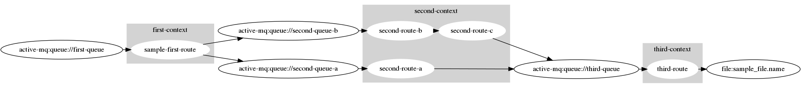

# blueprint-diagram

## Why?

As the amount of bundles in your integration project rises, it's nice to have a simplified view that shows the connections between them.  

## How this works

This program  
- Traverses given path, collecting all xml- and cfg-files.
- Filters out xml-files that are not valid blueprints
- Substitutes `${env:VARIABLE_DECLARATION}`s from cfg-files if any env-files are set.
- Substitutes `{{property_placeholders}}` from blueprints with values from cfg-files.
- Builds a [DOT-graph](https://en.wikipedia.org/wiki/DOT_(graph_description_language)) from camelContexts and routes.
- Writes `${output}.dot` which can be used with any DOT-renderer and `${output}.html` which can be viewed in a browser. 

This was built for a very specific use-case involving only camel blueprints, will not work with any other DSL, and 100% correct results cannot be guaranteed even with blueprints.

The DOT-nodes are (mostly) named only by the route id, so you are going to get unexpected results if you have multiple routes with the same id, even if they are located in a different camelContext. 

The mapping takes into consideration
- All `<from/>`-nodes in route
- All `<wireTap>`-nodes in route
- All `<simple/>` and `<constant/>` -nodes in recipientList 
- The last `<to/>`-node in route

Everything else is ignored, because this is not meant to be a complete description of the routes.

There is also no guarantee that a blueprint producing a nice looking graph actually even starts, because all parsing is done with Jsoup and it is never verified that the camelContexts are valid.

## Example

You can find the sources that produced that diagram below, in `/testcase/`.


## See also

- [Clikt](https://github.com/ajalt/clikt): This is used to parse command-line arguments.
- [DOT Guide](https://www.graphviz.org/pdf/dotguide.pdf): A very nice introduction to DOT-format.
- [D3.js](https://d3js.org/): This is used for rendering the produced diagram in html output (by d3-graphviz).
- [viz-js](https://github.com/mdaines/viz.js): This is used for rendering the produced diagram in html output (by d3-graphviz).
- [d3-graphviz](https://github.com/magjac/d3-graphviz): This renders the diagram in html output. 

## Compiling / Installation

`mvn clean package` - For use from command line

`mvn clean install` - Install as maven build plugin to local repository

## Usage

### From command-line
```bash
java -jar target/blueprint-diagram-1.0-SNAPSHOT-jar-with-dependencies.jar --env "comma-separated,list-of-env-files" --path "path/to/your/blueprints" --output test
```

### As Maven build plugin

```xml
<plugin>
  <groupId>com.jkilp</groupId>
  <artifactId>blueprint-diagram</artifactId>
  <version>1.0-SNAPSHOT</version>
  <inherited>false</inherited> <!-- Only required if used on a parent pom. -->
  <configuration>
    <env>${project.basedir}/your-env-file.env</env> <!-- Not required, multiple values accepted. -->
    <path>${project.basedir}</path> <!-- Defaults to . -->
    <output>integrations</output> <!-- Output filenames ${output}.{html|dot} Defaults to "output" -->
  </configuration>
  <executions>
    <execution>
      <id>documentation</id>
      <phase>generate-sources</phase>
      <goals>
        <goal>diagram</goal>
      </goals>
    </execution>
  </executions>
</plugin>
```